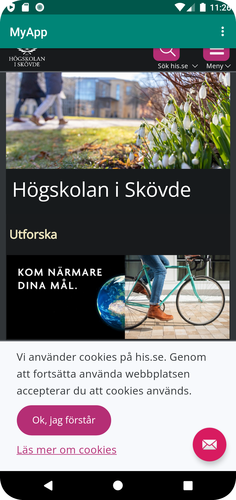
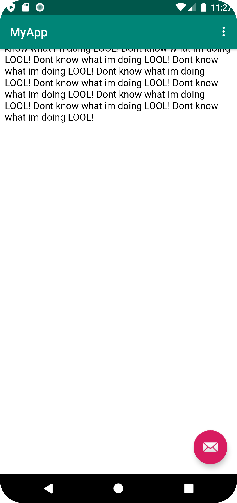

# Rapport

1. Jag började uppgiften med att först forka github repositoryn webview och klonade den till min android project.
2. Bytte namn på min application till ett valfritt namn.Detta gjordes i string.xml filen.
   Enablade internet access till min App, vilket görs med kodsnittet nedan i manifest filen.

    `"<string name="app_name">MyApp</string>`
   ` <uses-permission android:name="android.permission.INTERNET" />`
3. Skapade en layout fil genom att byta ut den existerande textview till en Webview.

```
    <WebView
            android:layout_width="match_parent"
            android:layout_height="match_parent"
            android:id="@+id/myWebView"
            android:text="WAGUAN BLOOD!"
            app:layout_constraintBottom_toBottomOf="parent"
            app:layout_constraintLeft_toLeftOf="parent"
            app:layout_constraintRight_toRightOf="parent"
            app:layout_constraintTop_toTopOf="parent" />
```

 4. Gav den nya webviewen en id som senare ska användas för att referera till den. Detta görs med kodsnittet nedan som finns i  contetn_mail.xml filen

    `android:id="@+id/myWebView"`
 5. Skapade sedan en privat WebView instance variable i Main.activity.
        `"private WebView myWebView;"´
 6. Den nyskapade instans variabeln instansierades i onCreate() och
    findViewByID metoden användes för att koppla det till det ID som Webviewn har.
 7.Skapade en ny WebClient och lade till min webview i den. Tillät sedan  javaScript exekvering till WebClient

``` WebViewClient myWebViewClient = new WebViewClient();
        myWebView.setWebViewClient(myWebViewClient);
        myWebView.getSettings().setJavaScriptEnabled(true);
```
 8. Implementerade metoderna showInternalWebpage och showExternalWebpage genom att använda loadURl() metoden och sedan skicka antingen en intern fil eller en extern fil
 i parametern.
```
    public void ShowExternalPage(){

            myWebView.loadUrl("https://his.se");

        }

    public void ShowInternalPage(){

            myWebView.loadUrl("file:///android_asset/about.html");

        }
```
 9. Kallade på metoderna showExternalWebpage() och ShowInternalPage() i onOptionItemSelected(), där respektive metod kallas när de trycks på i dropdown menyn.ShowInternalPage

```     if (id == R.id.action_external_web) {
                Log.d("==>","Will display external web page");
                ShowExternalPage();
                return true;

            }
     if (id == R.id.action_internal_web) {
                 Log.d("==>","Will display internal web page");
                ShowInternalPage();
                 return true;
             }
```




